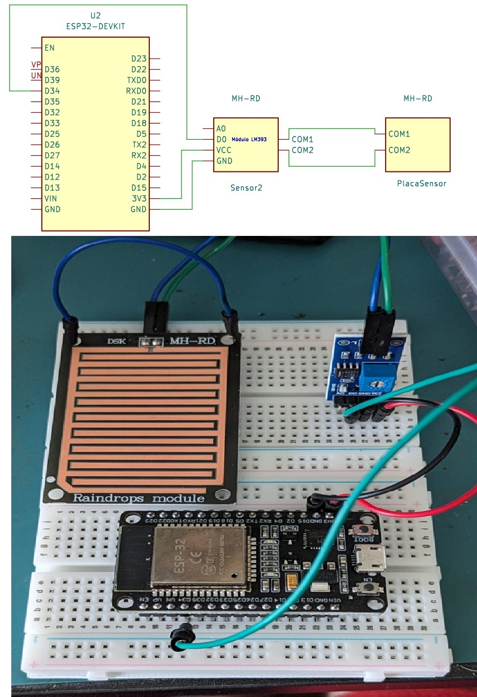
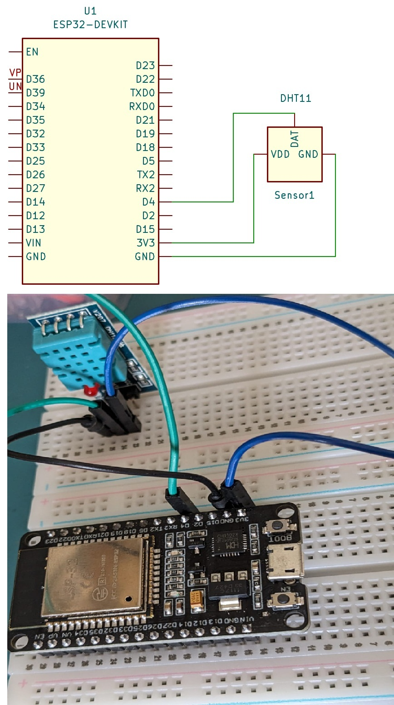
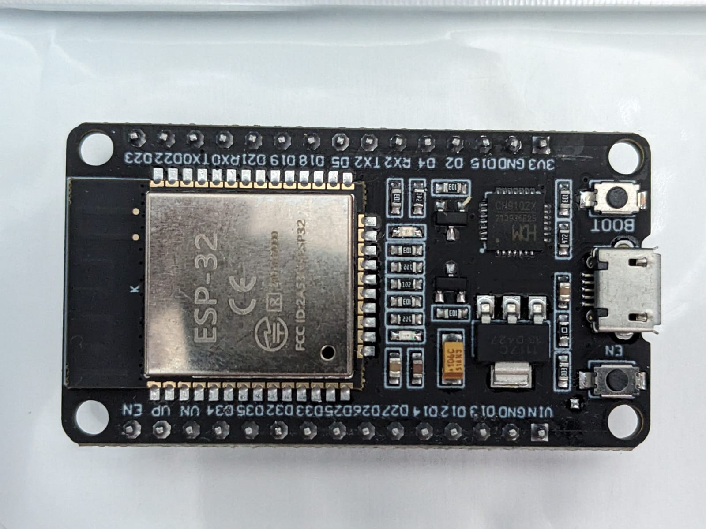
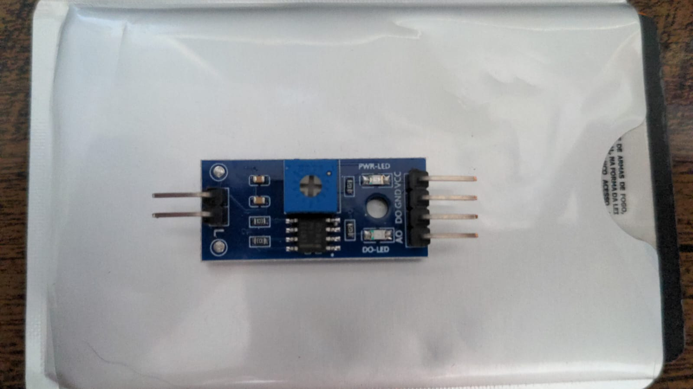
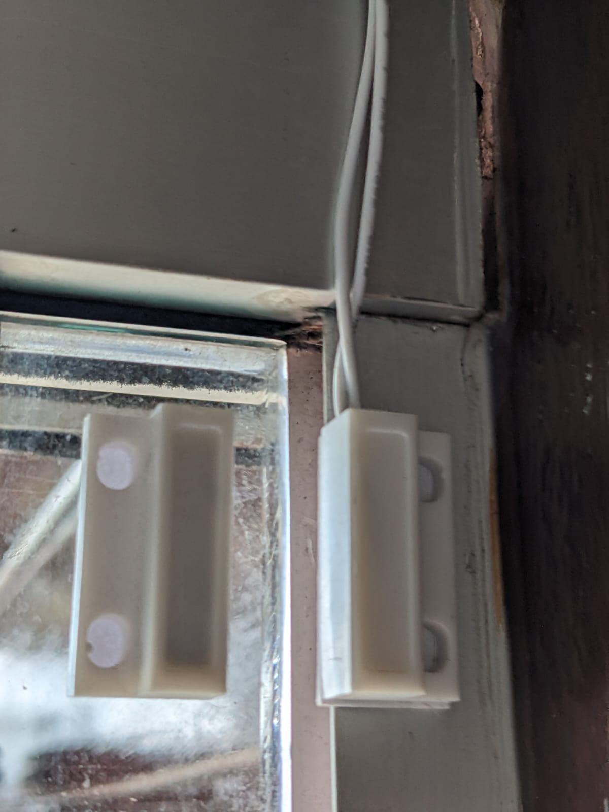
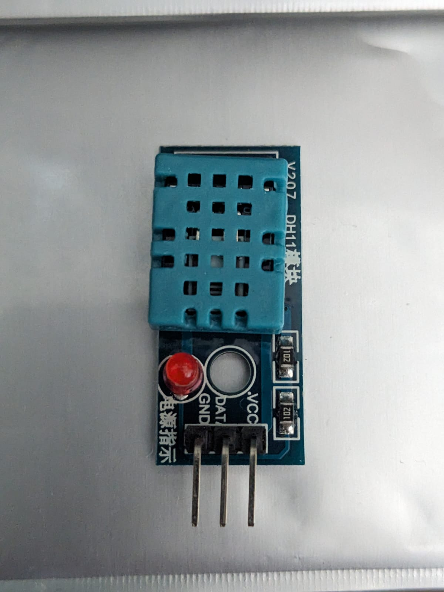

# Sistema IoT de Monitoramento Residencial Inteligente e Segurança Periférica com ESP32


## 📌 Concepção e Objetivo do Projeto
Este projeto consiste no desenvolvimento de um sistema embarcado de automação, monitoramento ambiental e segurança perimetral residencial, fundamentado nas premissas da **Internet das Coisas (IoT)**. Desenvolvido como protótipo funcional para fins acadêmicos de Pós-Graduação, o ecossistema utiliza a placa de desenvolvimento **ESP32 DevKit** como unidade central de processamento para gerenciar, de forma assíncrona, sensores meteorológicos, termo-higrométricos e de intrusão física.

O principal objetivo técnico é garantir a integridade dos dados locais, transmitindo-os de maneira otimizada e segura para plataformas em nuvem, permitindo que o usuário interaja e receba alertas críticos em tempo real, independentemente de sua localização geográfica.

---

## 🏗️ Modelagem e Arquitetura do Sistema 

O fluxo de dados do ecossistema foi estruturado sob o conceito de **comunicação bidirecional**, segregado em três camadas fundamentais (Percepção, Transporte e Aplicação):

```text
  [ CAMADA DE PERCEPÇÃO ]            [ CAMADA DE TRANSPORTE ]            [ CAMADA DE APLICAÇÃO ]
  ┌──────────────────────┐                                               ┌──────────────────────┐
  │  Sensor MH-RD        │ ──┐                                        ┌> │  HiveMQ Cloud (MQTT) │
  │  (Chuva / Digital)   │   │                                        │  └──────────────────────┘
  ├──────────────────────┤   │    ┌─────────────────────────────┐     │
  │  Sensor Magnético    │   ├──> │        ESP32 DevKit         │ ────┤
  │  (Porta / Reed)      │   │    │ - Gestão por Edge Trigger   │     │
  ├──────────────────────┤   │    │ - Portal Cativo Local       │     │  ┌──────────────────────┐
  │  Sensor DHT11        │ ──┘    └─────────────────────────────┘     └> │  Telegram Bot API    │
  │  (Temp. / Umidade)   │                                               └──────────────────────┘
  └──────────────────────┘
```

### 1. Monitoramento Ativo (Modo Publisher / Transmissão Assíncrona)
O sistema opera baseado no princípio de **Gatilho por Borda (Edge Triggering)**. Os sensores de perímetro e meteorológicos são monitorados continuamente na camada de hardware. No entanto, o envio de dados para a nuvem só ocorre quando há uma **transição real de estado físico** (ex: o início/fim de uma chuva ou a abertura/fechamento de uma porta). Essa abordagem de engenharia de software elimina o tráfego de rede redundante, reduzindo o consumo de banda e poupando ciclos de processamento da MCU.

### 2. Requisições Sob Demanda (Modo Subscriber / Interação Remota)
A camada de aplicação permite que o usuário faça consultas ativas ao sistema. Ao enviar um comando de texto estruturado pela interface do usuário, a solicitação é transportada até o microcontrolador, que realiza a leitura imediata dos parâmetros ambientais de temperatura e umidade, retornando as métricas instantaneamente.

---

## 📸 Demonstração Visual do Protótipo

Abaixo está disposto o registro visual da das conexões de Hardware para cada unidade de processamento do ecossistema IoT residencial.

<p align="center">
 
  
  <br>
  <em>Figura 1: Unidade de Processamento Central baseada na placa de desenvolvimento ESP32 DevKit + Módulo MH-RD (CHUVA).</em>
</p>

<p align="center">

  
  <br>
  <em>Figura 2: Unidade de Processamento Central baseada na placa de desenvolvimento ESP32 DevKit + DHT11 (TEMP).</em>
</p>


---

## 🛠️ Especificações Técnicas de Hardware

A seleção dos componentes obedeceu a critérios rígidos de estabilidade de sinal, isolamento de ruídos eletromagnéticos e compatibilidade nativa de níveis lógicos em **3.3V DC**:

*   **Unidade de Processamento Central (MCU):** Placa de Desenvolvimento **ESP32 DevKit**. Baseada no SoC Xtensa Dual-Core de 32 bits com clock de até 240 MHz. Integra regulador de tensão onboard para conversão de alimentação USB/Externa para os níveis de barramento internos, além de transceptores para redes sem fio (Wi-Fi 802.11 b/g/n) e subsistema de memória não-volátil (NVS).
<p align="center">
  
  <br>
  <em>Figura 1: MCU tipo Esp32 DEVKIT responsável pelo processamento.</em>
</p>

*   **Módulo Sensor Pluviométrico (MH-RD):** Composto por uma grade condutora exposta à precipitação e um circuito integrador baseado no comparador de tensão **LM393**. O módulo filtra as variações resistivas provocadas pela condutividade da água e entrega um sinal digital estabilizado.

<p align="center">
  
  
  <br>
  <em>Figura 2: Componentes do sensor de chuva (Esquerda: Placa sensora resistiva MH-RD; Direita: Módulo comparador de sinal LM393).</em>
</p>

*   **Sensor de Intrusão (Porta):** Interruptor magnético MC 38 *Reed Switch* operando como contato aberto/fechado.
<p align="center">
  
  <br>
  <em>Figura 3: Sensor MC 38 Reed Switch responsável por informar o estado aberto/fechado de porta.</em>
</p>

*   **Sensor Termo-Higrométrico (DHT11):** Transmissor digital microcontrolado que integra um sensor capacitivo de umidade e um termistor do tipo NTC, convertendo grandezas analógicas em pacotes de dados digitais por meio de protocolo de fio único (*Single-Wire*).

<p align="center">
  
  <br>
  <em>Figura 4: Sensor Termo-Higrométrico (DHT11) responsável pela coleta das grandezas de temperatura e umidade.</em>
</p>

### 📌 Justificativa Técnica da Pinagem Escolhida
*   **GPIO 34 (Sensor de Chuva):** Pino físico do barramento do ESP32 DevKit configurado estritamente como entrada de dados (*Input Only*). A escolha baseia-se no fato de pertencer ao barramento interno **ADC1**, o que impede falhas de leitura ou desconexões quando o modem Wi-Fi do chip exige máxima corrente de transmissão (uma limitação física conhecida do barramento secundário ADC2 do ESP32).
*   **GPIO 23 (Sensor de Porta):** Mapeado com o resistor interno de pull-up da arquitetura do chip (`INPUT_PULLUP`). Isso garante que a linha de sinal mantenha-se em nível lógico estável (HIGH) quando o ímã se afasta do sensor, mitigando o efeito de estado flutuante (*floating state*) induzido por ruídos eletromagnéticos externos.
*   **GPIO 0 (Botão BOOT):** Pino nativo de seleção de modo de gravação presente na placa DevKit, reutilizado por software em tempo de execução para atuar como um botão físico de *Factory Reset* das configurações lógicas de rede.

---

## 🌐 Integração, Redes e Protocolos de Comunicação

### 1. Provisionamento de Rede Sem Fio Dinâmico
Para garantir a segurança do sistema e evitar o armazenamento rígido (*hardcoded*) de credenciais de rede domésticas no código-fonte, o sistema implementa um **Gerenciador Dinâmico de Provisionamento**. 
* Caso o dispositivo perca a conectividade ou seja inicializado em um novo ambiente, ele gera autonomamente uma rede local criptografada no modo **Access Point (AP)** com portal cativo HTTP.
* O usuário se conecta a este ponto de acesso via dispositivo móvel para selecionar e salvar de forma segura as novas credenciais de rede diretamente na memória flash do chip.

### 2. Protocolo de Mensagens MQTT via Broker Cloud
O transporte das informações estruturadas de telemetria é feito através do protocolo **MQTT (Message Queuing Telemetry Transport)**, utilizando pacotes leves em formato **JSON**. A comunicação é direcionada por meio de sockets criptografados TLS (porta padrão 8883) para um cluster em nuvem de alta disponibilidade do **HiveMQ Cloud**, organizados sob tópicos hierárquicos. O cliente de rede dispensa a validação estática de cadeias de certificados públicos locais para otimizar o uso da memória RAM (SRAM) do sistema embarcado.

### 3. Interface Homem-Máquina (IHM) com Controle de Acesso
A camada de interação com o usuário final é integrada diretamente à API de mensagem do **Telegram**. Para assegurar a confidencialidade e a integridade da automação residencial, o sistema possui uma diretiva rígida de controle de acesso baseada no identificador numérico único do usuário (*Chat ID*) e Token. Qualquer tentativa de comando ou requisição originada por contas não cadastradas é sumariamente rejeitada pelo microcontrolador, ainda que tenham acessado o bot.

<p align="center">
  
  <br>
  <em>Figura 4: Visão geral do funcionamento do bot.</em>
</p>

